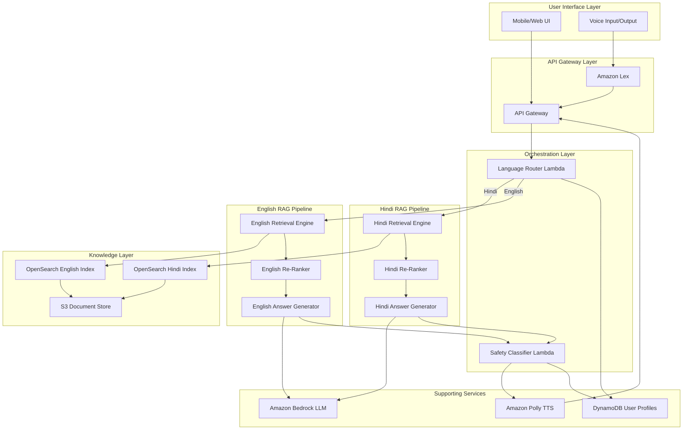
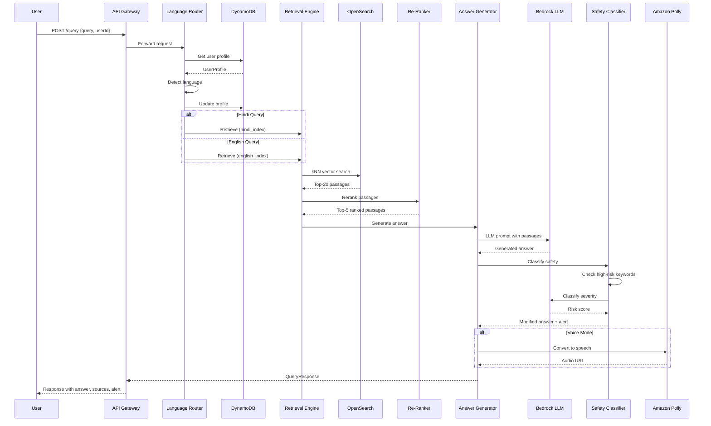
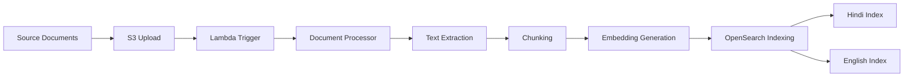

# Design Document: Maatri Maternal Health Assistant

## Overview

Maatri is a bilingual AI-powered maternal healthcare assistant that provides verified pregnancy guidance to expecting mothers in India. The system implements a dual-pipeline Retrieval-Augmented Generation (RAG) architecture on AWS, maintaining separate Hindi and English processing flows to preserve linguistic accuracy and cultural context.

The architecture prioritizes safety, accessibility, and trustworthiness through:
- Language-specific RAG pipelines with dedicated vector indexes
- Multi-stage retrieval (semantic search + cross-encoder re-ranking)
- Source citation for all factual claims
- Safety classification for high-risk symptom detection
- Voice and text interaction modes for low-literacy users
- Low-bandwidth optimization for rural connectivity

### Key Design Principles

1. **Safety First**: No diagnostic claims, mandatory disclaimers, emergency escalation
2. **Linguistic Fidelity**: Separate pipelines preserve Hindi and English semantic accuracy
3. **Source Transparency**: Every response includes citations to verified sources
4. **Accessibility**: Voice interface, simple language, low-bandwidth support
5. **Modularity**: Independent, API-driven components for maintainability

## Architecture

### High-Level System Architecture



### Component Architecture

The system follows a modular, event-driven architecture with clear separation of concerns:

1. **Interaction Layer**: API Gateway + Amazon Lex handle all user interactions
2. **Routing Layer**: Language detection and pipeline selection
3. **Retrieval Layer**: Dual OpenSearch indexes with semantic vector search
4. **Re-ranking Layer**: Cross-encoder models for relevance scoring
5. **Generation Layer**: Amazon Bedrock LLM for answer synthesis
6. **Safety Layer**: Risk detection and emergency escalation
7. **Storage Layer**: S3 for documents, DynamoDB for user data

## Components and Interfaces

### 1. API Gateway

**Responsibility**: Entry point for all HTTP requests, authentication, rate limiting

**Endpoints**:
- `POST /query` - Submit text query
- `POST /voice-query` - Submit voice query (proxies to Lex)
- `GET /faq` - Retrieve FAQ list
- `GET /faq/{id}` - Retrieve specific FAQ answer
- `POST /profile` - Update user profile
- `GET /profile/{userId}` - Retrieve user profile

**Interface**:
```typescript
interface QueryRequest {
  userId: string;
  query: string;
  language?: 'hindi' | 'english' | 'auto';
  mode?: 'standard' | 'short' | 'voice';
}

interface QueryResponse {
  answer: string;
  sources: Source[];
  language: 'hindi' | 'english';
  safetyAlert?: SafetyAlert;
  audioUrl?: string; // For voice mode
}

interface Source {
  title: string;
  url: string;
  excerpt: string;
}

interface SafetyAlert {
  severity: 'high' | 'medium';
  message: string;
  emergencyContacts: string[];
}
```

### 2. Amazon Lex Integration

**Responsibility**: Speech-to-text conversion, voice interaction management

**Configuration**:
- Bot name: `MaatriVoiceBot`
- Languages: Hindi (hi-IN), English (en-IN)
- Intents: `AskQuestion`, `BrowseFAQ`, `UpdateProfile`
- Slots: `QuestionText`, `Language`, `PregnancyStage`

**Interface**:
```typescript
interface LexRequest {
  inputTranscript: string;
  sessionAttributes: {
    userId: string;
    language: string;
  };
}

interface LexResponse {
  message: string;
  sessionAttributes: Record<string, string>;
}
```

### 3. Language Router Lambda

**Responsibility**: Detect input language, route to appropriate RAG pipeline, manage user profiles

**Algorithm**:
```
function routeQuery(request: QueryRequest):
  1. Load user profile from DynamoDB
  2. If language specified in request, use it
  3. Else if language in user profile, use it
  4. Else detect language using:
     - Character set analysis (Devanagari vs Latin)
     - Bedrock language classification
  5. Update user profile with detected language
  6. Route to Hindi or English RAG pipeline
  7. Return response with language metadata
```

**Interface**:
```typescript
interface LanguageRouterInput {
  query: string;
  userId: string;
  explicitLanguage?: 'hindi' | 'english';
}

interface LanguageRouterOutput {
  detectedLanguage: 'hindi' | 'english';
  routedPipeline: 'hindi_rag' | 'english_rag';
  userProfile: UserProfile;
}

interface UserProfile {
  userId: string;
  preferredLanguage: 'hindi' | 'english';
  pregnancyStage?: 'first' | 'second' | 'third';
  lowBandwidth: boolean;
  lastInteraction: string; // ISO timestamp
}
```

### 4. Retrieval Engine (OpenSearch)

**Responsibility**: Semantic vector search over verified maternal health documents

**Index Configuration**:

Hindi Index (`hindi_index`):
```json
{
  "mappings": {
    "properties": {
      "doc_id": { "type": "keyword" },
      "content": { "type": "text", "analyzer": "hindi" },
      "embedding": { 
        "type": "knn_vector", 
        "dimension": 768,
        "method": {
          "name": "hnsw",
          "engine": "nmslib"
        }
      },
      "source_title": { "type": "text" },
      "source_url": { "type": "keyword" },
      "topic": { "type": "keyword" },
      "trimester": { "type": "keyword" }
    }
  }
}
```

English Index (`english_index`): Similar structure with English analyzer

**Retrieval Algorithm**:
```
function retrievePassages(query: string, language: string, k: int):
  1. Generate query embedding using language-specific bi-encoder
  2. Perform kNN search in appropriate index (hindi_index or english_index)
  3. Apply filters if user profile has pregnancy stage:
     - Boost passages matching trimester
  4. Retrieve top-k passages (k=20)
  5. Return passages with metadata (source, score)
```

**Interface**:
```typescript
interface RetrievalRequest {
  query: string;
  language: 'hindi' | 'english';
  topK: number;
  filters?: {
    trimester?: 'first' | 'second' | 'third';
    topic?: string;
  };
}

interface RetrievalResponse {
  passages: Passage[];
}

interface Passage {
  docId: string;
  content: string;
  score: number;
  sourceTitle: string;
  sourceUrl: string;
  topic: string;
  trimester?: string;
}
```

### 5. Re-Ranker (SageMaker Cross-Encoder)

**Responsibility**: Re-score retrieved passages using query-passage cross-attention

**Model**: Fine-tuned cross-encoder (e.g., `cross-encoder/ms-marco-MiniLM-L-6-v2`) on maternal health Q&A pairs

**Deployment**: SageMaker real-time endpoint with auto-scaling

**Algorithm**:
```
function rerankPassages(query: string, passages: Passage[], topN: int):
  1. For each passage:
     a. Create query-passage pair
     b. Send to SageMaker cross-encoder endpoint
     c. Receive relevance score (0-1)
  2. Sort passages by cross-encoder score (descending)
  3. Return top-N passages (N=5)
```

**Interface**:
```typescript
interface RerankRequest {
  query: string;
  passages: Passage[];
  topN: number;
}

interface RerankResponse {
  rankedPassages: RankedPassage[];
}

interface RankedPassage extends Passage {
  crossEncoderScore: number;
  rank: number;
}
```

### 6. Answer Generator (Amazon Bedrock)

**Responsibility**: Synthesize natural language answers from retrieved passages

**Model**: Amazon Bedrock (Claude 3 Sonnet or Haiku for cost optimization)

**Prompt Template**:
```
You are Maatri, a helpful maternal health assistant for expecting mothers in India.

IMPORTANT SAFETY RULES:
- You do NOT provide medical diagnosis
- You do NOT prescribe treatments
- Always include: "This is general guidance. Please consult your doctor for personalized advice."

USER QUESTION: {query}

VERIFIED INFORMATION:
{passage_1}
Source: {source_1}

{passage_2}
Source: {source_2}

...

INSTRUCTIONS:
1. Answer the question using ONLY the verified information above
2. Use simple, conversational language
3. If the user is in {trimester} trimester, provide relevant context
4. If information is not in the passages, say "I don't have verified information about this"
5. Include source references in your answer
6. Add the safety disclaimer at the end

Answer in {language}:
```

**Interface**:
```typescript
interface GenerationRequest {
  query: string;
  passages: RankedPassage[];
  language: 'hindi' | 'english';
  userProfile: UserProfile;
  mode: 'standard' | 'short';
}

interface GenerationResponse {
  answer: string;
  sourcesUsed: Source[];
}
```

### 7. Safety Classifier Lambda

**Responsibility**: Detect high-risk symptoms, trigger emergency alerts

**Classification Approach**:
1. **Rule-based detection**: Keyword matching for critical symptoms
2. **ML classification**: Bedrock classifier for symptom severity

**High-Risk Symptom Keywords** (Hindi + English):
- Severe bleeding / अत्यधिक रक्तस्राव
- Severe abdominal pain / गंभीर पेट दर्द
- No fetal movement / भ्रूण की गति नहीं
- Severe headache with vision changes / दृष्टि परिवर्तन के साथ गंभीर सिरदर्द
- High fever / तेज बुखार
- Difficulty breathing / सांस लेने में कठिनाई

**Algorithm**:
```
function classifySafety(query: string, answer: string):
  1. Check query for high-risk keywords
  2. If keywords found:
     a. Use Bedrock classifier to confirm severity
     b. If severity >= 0.7:
        - Set safetyAlert.severity = 'high'
        - Prepend emergency message to answer
        - Include emergency contact numbers
  3. Always append medical disclaimer to answer
  4. Return modified response with safety metadata
```

**Interface**:
```typescript
interface SafetyClassificationRequest {
  query: string;
  answer: string;
  language: 'hindi' | 'english';
}

interface SafetyClassificationResponse {
  safetyAlert?: SafetyAlert;
  modifiedAnswer: string;
  riskScore: number; // 0-1
}
```

### 8. Amazon Polly Integration

**Responsibility**: Convert text responses to speech for voice mode

**Configuration**:
- Hindi voice: `Aditi` (female, Indian accent)
- English voice: `Raveena` (female, Indian accent)
- Output format: MP3, 24kbps (low bandwidth)

**Interface**:
```typescript
interface PollyRequest {
  text: string;
  language: 'hindi' | 'english';
  voiceId: string;
}

interface PollyResponse {
  audioUrl: string; // S3 presigned URL
  duration: number; // seconds
}
```

### 9. FAQ Browser

**Responsibility**: Provide pre-generated answers to common questions

**Storage**: DynamoDB table with pre-computed FAQ answers

**Schema**:
```typescript
interface FAQ {
  faqId: string;
  question: string;
  answer: string;
  language: 'hindi' | 'english';
  category: string;
  trimester?: 'first' | 'second' | 'third';
  sources: Source[];
}
```

**Categories**:
- Nutrition / पोषण
- Symptoms / लक्षण
- Exercise / व्यायाम
- Medical Tests / चिकित्सा परीक्षण
- Government Schemes / सरकारी योजनाएं
- Postpartum Care / प्रसवोत्तर देखभाल

## Data Models

### User Profile (DynamoDB)

```typescript
interface UserProfile {
  userId: string; // Partition key
  preferredLanguage: 'hindi' | 'english';
  pregnancyStage?: {
    trimester: 'first' | 'second' | 'third';
    dueDate?: string; // ISO date
  };
  preferences: {
    lowBandwidth: boolean;
    voiceMode: boolean;
    shortAnswers: boolean;
  };
  interactionHistory: {
    lastInteraction: string; // ISO timestamp
    queryCount: number;
    topTopics: string[]; // Most queried topics
  };
  createdAt: string;
  updatedAt: string;
}
```

### Document Metadata (S3 + OpenSearch)

```typescript
interface Document {
  docId: string;
  title: string;
  sourceUrl: string;
  sourceType: 'government' | 'who' | 'medical_journal' | 'ngo';
  language: 'hindi' | 'english';
  content: string;
  chunks: DocumentChunk[]; // Split for embedding
  verifiedBy: string; // Medical reviewer
  lastUpdated: string;
}

interface DocumentChunk {
  chunkId: string;
  content: string;
  embedding: number[]; // 768-dim vector
  topic: string;
  trimester?: 'first' | 'second' | 'third';
  startOffset: number;
  endOffset: number;
}
```

### Query Log (DynamoDB)

```typescript
interface QueryLog {
  logId: string; // Partition key
  userId: string; // GSI
  timestamp: string; // Sort key
  query: string;
  language: 'hindi' | 'english';
  retrievedPassages: string[]; // docIds
  answer: string;
  safetyAlert?: boolean;
  responseTime: number; // milliseconds
}
```

## Data Flow

### End-to-End Query Processing



### Document Ingestion Pipeline



**Ingestion Steps**:
1. Upload verified documents to S3 bucket
2. S3 event triggers Lambda function
3. Extract text from PDF/HTML/DOCX
4. Split into semantic chunks (512 tokens with 50-token overlap)
5. Generate embeddings using SageMaker bi-encoder
6. Index in appropriate OpenSearch index (hindi_index or english_index)
7. Store metadata in DynamoDB for tracking

## Error Handling

### Error Categories and Responses

1. **Language Detection Failure**
   - Fallback: Default to English pipeline
   - Log: Warning with query text for analysis
   - User message: "I couldn't detect your language. I'll respond in English."

2. **No Relevant Passages Found**
   - Response: "I don't have verified information about this topic. Please consult your doctor."
   - Log: Query for knowledge base expansion
   - No hallucination: Never generate answers without retrieved passages

3. **OpenSearch Unavailable**
   - Fallback: Return cached FAQ if query matches
   - User message: "I'm experiencing technical difficulties. Please try again in a moment."
   - Alert: CloudWatch alarm for ops team

4. **Bedrock LLM Timeout**
   - Retry: Up to 2 retries with exponential backoff
   - Fallback: Return top-ranked passage directly with disclaimer
   - Timeout: 10 seconds per request

5. **Safety Classifier Failure**
   - Fail-safe: Always append medical disclaimer
   - Default: Treat as medium-risk, include consultation recommendation
   - Alert: Log for manual review

6. **Voice Transcription Error**
   - Response: "I couldn't understand that. Could you please repeat?"
   - Retry: Allow up to 3 attempts
   - Fallback: Suggest text input mode

### Graceful Degradation Strategy

```
Priority 1 (Critical): Safety classification, medical disclaimer
Priority 2 (High): Answer generation, source citation
Priority 3 (Medium): Voice output, personalization
Priority 4 (Low): FAQ browsing, analytics logging

If component fails:
- P1 failure: Return error, do not provide medical guidance
- P2 failure: Return simplified response with disclaimer
- P3 failure: Provide text-only response
- P4 failure: Continue with core functionality
```

## Testing Strategy

The testing strategy employs a dual approach combining property-based testing for universal correctness properties and unit testing for specific examples, edge cases, and integration points.

### Property-Based Testing

Property-based tests will verify universal properties across randomized inputs using a property testing library (e.g., Hypothesis for Python, fast-check for TypeScript). Each test will run a minimum of 100 iterations to ensure comprehensive coverage.

**Configuration**:
- Minimum iterations: 100 per property test
- Each test tagged with: `Feature: maatri-maternal-health-assistant, Property {N}: {property_text}`
- Random seed logging for reproducibility
- Shrinking enabled for minimal failing examples

### Unit Testing

Unit tests will focus on:
- Specific examples demonstrating correct behavior
- Edge cases (empty inputs, special characters, boundary conditions)
- Error conditions and exception handling
- Integration points between components
- Mock external services (Bedrock, OpenSearch, Polly)

### Integration Testing

- End-to-end query flow testing
- Multi-component interaction validation
- AWS service integration verification
- Performance and latency benchmarks

### Safety Testing

- High-risk symptom detection accuracy
- False positive/negative rates for safety classifier
- Emergency escalation workflow validation
- Disclaimer presence verification


## Correctness Properties

A property is a characteristic or behavior that should hold true across all valid executions of a system—essentially, a formal statement about what the system should do. Properties serve as the bridge between human-readable specifications and machine-verifiable correctness guarantees.

The following properties define the correctness criteria for the Maatri system. Each property is universally quantified and will be validated through property-based testing with a minimum of 100 iterations per test.

### Property 1: Language Consistency

*For any* user query in Hindi or English, the system SHALL route to the corresponding language-specific RAG pipeline and produce a response in the same language as the input.

**Validates: Requirements 1.3, 1.4**

**Test approach**: Generate random queries in both Hindi and English, verify routing to correct pipeline (hindi_rag or english_rag), and verify response language matches input language.

### Property 2: Language Switching Detection

*For any* conversation sequence where the user switches from one language to another, the system SHALL detect the language change and route subsequent queries to the appropriate RAG pipeline.

**Validates: Requirements 1.5**

**Test approach**: Generate conversation sequences with language switches, verify that each query after a switch routes to the correct pipeline.

### Property 3: Retrieval Completeness

*For any* query and specified top-k value, the Retrieval Engine SHALL return exactly k passages (or fewer if the index contains fewer than k documents) from the language-specific index.

**Validates: Requirements 2.2, 2.3**

**Test approach**: Generate random queries with various k values, verify result count equals min(k, total_documents) and all results come from correct language index.

### Property 4: Re-Ranking Scoring

*For any* set of retrieved passages, the Re-Ranker SHALL assign a relevance score to each passage, and the final ranked list SHALL be ordered by descending score.

**Validates: Requirements 2.4**

**Test approach**: Generate random passage sets, verify all passages receive scores, verify descending order.

### Property 5: Source Citation Presence

*For any* generated response containing factual information, the system SHALL include at least one Source_Citation with title and URL.

**Validates: Requirements 2.6, 8.4**

**Test approach**: Generate random queries, verify all non-empty responses contain source citations in the expected format.

### Property 6: Context Grounding

*For any* generated answer, all factual claims SHALL be traceable to content in the provided retrieved passages (no hallucination beyond context).

**Validates: Requirements 2.5**

**Test approach**: Generate random queries, extract key facts from generated answers, verify each fact appears in or is inferable from the retrieved passages.

### Property 7: Trimester-Aware Responses

*For any* query where the User_Profile contains pregnancy stage information, the generated response SHALL reference or be contextually relevant to the specified trimester.

**Validates: Requirements 3.3**

**Test approach**: Generate random queries with user profiles containing trimester data, verify responses mention or are filtered for the specified trimester.

### Property 8: Short Answer Mode

*For any* query processed in short-answer mode, the response length SHALL be less than the response length for the same query in standard mode.

**Validates: Requirements 3.5**

**Test approach**: Generate random queries, process in both modes, verify short mode produces shorter responses (measured in characters or tokens).

### Property 9: Voice Language Selection

*For any* text-to-speech request, the Voice_Interface SHALL select a voice that matches the response language (Hindi voice for Hindi text, English voice for English text).

**Validates: Requirements 4.3**

**Test approach**: Generate random responses in both languages, verify voice selection matches language (Aditi for Hindi, Raveena for English).

### Property 10: Safety Classification

*For any* user query describing symptoms, the Safety_Classifier SHALL analyze the input and produce a risk score between 0 and 1.

**Validates: Requirements 5.1**

**Test approach**: Generate random symptom descriptions, verify all receive risk scores in valid range [0, 1].

### Property 11: High-Risk Alert Generation

*For any* query containing high-risk symptom keywords, the system SHALL generate a SafetyAlert with severity level and emergency contact information.

**Validates: Requirements 5.2**

**Test approach**: Generate queries containing known high-risk keywords (severe bleeding, no fetal movement, etc.), verify SafetyAlert is present in response.

### Property 12: Medical Disclaimer Presence

*For any* response providing medical guidance, the system SHALL include a disclaimer stating it does not provide medical diagnosis.

**Validates: Requirements 5.3**

**Test approach**: Generate random health-related queries, verify all responses contain the required disclaimer text.

### Property 13: Government Scheme Retrieval

*For any* query about government programs or financial assistance, the retrieved passages SHALL include documents tagged with the "government_scheme" topic.

**Validates: Requirements 6.2**

**Test approach**: Generate queries about government schemes, verify retrieved passages contain government_scheme topic tag.

### Property 14: Government Scheme Response Completeness

*For any* response about government schemes, the answer SHALL include eligibility criteria, application procedures, and source citations from official government URLs.

**Validates: Requirements 6.3, 6.4**

**Test approach**: Generate government scheme queries, verify responses contain eligibility keywords, application keywords, and government domain sources.

### Property 15: User Profile Creation

*For any* new userId that has not previously interacted with the system, the first interaction SHALL create a User_Profile in DynamoDB.

**Validates: Requirements 7.1**

**Test approach**: Generate random new userIds, verify profile creation after first query.

### Property 16: User Profile Round-Trip

*For any* user profile update (language preference or pregnancy stage), retrieving the profile SHALL return the same values that were stored.

**Validates: Requirements 7.2, 7.3**

**Test approach**: Generate random profile updates, store them, retrieve profiles, verify stored values match retrieved values.

### Property 17: Profile Retrieval for Returning Users

*For any* userId with an existing User_Profile, subsequent interactions SHALL retrieve and use the stored profile data.

**Validates: Requirements 7.4**

**Test approach**: Create profiles for random userIds, make subsequent queries, verify profile is loaded and used.

### Property 18: Profile-Based Personalization

*For any* query where the User_Profile contains preferences (language, trimester, low bandwidth), the response SHALL reflect those preferences.

**Validates: Requirements 7.5**

**Test approach**: Generate queries with various profile preferences, verify responses match preferences (correct language, trimester context, response length).

### Property 19: FAQ Categorization

*For any* FAQ list response, all FAQ items SHALL have a category field and be organized by category and trimester.

**Validates: Requirements 8.2, 8.3**

**Test approach**: Retrieve FAQ lists, verify all items have category and trimester fields, verify grouping.

### Property 20: FAQ Bilingual Availability

*For any* FAQ in one language, there SHALL exist an equivalent FAQ with the same faqId in the other language.

**Validates: Requirements 8.5**

**Test approach**: Retrieve all FAQs in Hindi, verify corresponding English FAQs exist with matching faqIds.

### Property 21: Low Bandwidth Mode Prioritization

*For any* query where the User_Profile indicates low bandwidth preference, the system SHALL disable voice mode and return text-only responses.

**Validates: Requirements 9.1**

**Test approach**: Generate queries with low bandwidth flag set, verify response does not include audioUrl field.

### Property 22: Low Bandwidth Response Reduction

*For any* query with low bandwidth preference enabled, the response length SHALL be shorter than the same query without the preference.

**Validates: Requirements 9.3**

**Test approach**: Generate random queries, process with and without low bandwidth flag, verify low bandwidth responses are shorter.

### Property 23: Response Caching

*For any* recent query (within last N minutes), if a network error occurs, the system SHALL return a cached response rather than failing.

**Validates: Requirements 9.5**

**Test approach**: Make queries, simulate network failures, verify cached responses are returned for recent queries.

### Property 24: Graceful Degradation

*For any* component failure (Bedrock timeout, OpenSearch unavailable, etc.), the system SHALL return an error response with appropriate message rather than crashing.

**Validates: Requirements 10.5**

**Test approach**: Simulate various component failures, verify system returns structured error responses rather than exceptions.

### Property 25: No Diagnostic Storage

*For any* stored query log or user profile, the data SHALL NOT contain medical diagnostic terms or personally identifiable diagnoses.

**Validates: Requirements 12.3**

**Test approach**: Generate queries with diagnostic terms, store logs, verify stored data has diagnostic terms removed or anonymized.

### Property 26: User Data Deletion

*For any* user data deletion request, all User_Profile data and query logs for that userId SHALL be removed from DynamoDB.

**Validates: Requirements 12.4**

**Test approach**: Create user profiles and logs, issue deletion requests, verify all data is removed.

### Property 27: Administrative Access Control

*For any* administrative endpoint request without valid authentication credentials, the system SHALL reject the request with a 401 or 403 status code.

**Validates: Requirements 12.5**

**Test approach**: Generate requests to admin endpoints without credentials, verify rejection with appropriate status codes.

---

### Edge Cases and Examples

The following scenarios will be tested using unit tests rather than property-based tests, as they represent specific edge cases or integration points:

**Edge Case 1: Empty Retrieval Results**
- When no relevant passages are found, system returns "I don't have verified information about this topic"
- **Validates: Requirements 3.4**

**Edge Case 2: Poor Voice Quality**
- When voice transcription confidence is low, system requests clarification
- **Validates: Requirements 4.4**

**Integration Example 1: Amazon Lex Integration**
- Voice input correctly interfaces with Amazon Lex for speech-to-text
- **Validates: Requirements 1.2, 4.1**

**Integration Example 2: Amazon Polly Integration**
- Text responses correctly interface with Amazon Polly for speech synthesis
- **Validates: Requirements 4.2**

**Integration Example 3: FAQ Browser Endpoint**
- GET /faq endpoint returns categorized FAQ list
- **Validates: Requirements 8.1**

**Integration Example 4: Retrieval Engine API**
- Retrieval Engine exposes REST API that responds to passage retrieval requests
- **Validates: Requirements 11.3**

**Integration Example 5: Bedrock API Integration**
- Answer Generator successfully calls Amazon Bedrock API for LLM inference
- **Validates: Requirements 11.5**

**Configuration Example 1: DynamoDB Encryption**
- DynamoDB tables have encryption at rest enabled
- **Validates: Requirements 12.1**

**Configuration Example 2: TLS Encryption**
- All API endpoints use HTTPS with valid TLS certificates
- **Validates: Requirements 12.2**

**Configuration Example 3: Compression**
- API responses include compression headers (gzip or brotli)
- **Validates: Requirements 9.2**


## Performance Considerations

### Latency Targets

- **End-to-end query response**: < 3 seconds (p95)
- **Retrieval (OpenSearch)**: < 500ms
- **Re-ranking**: < 300ms
- **LLM generation**: < 2 seconds
- **Voice synthesis**: < 1 second

### Optimization Strategies

1. **Caching**:
   - Cache frequent queries in ElastiCache (Redis)
   - Cache FAQ responses in CloudFront CDN
   - Cache user profiles in Lambda memory (5-minute TTL)

2. **Batch Processing**:
   - Batch re-ranking requests when possible
   - Pre-compute FAQ answers during off-peak hours

3. **Index Optimization**:
   - Use HNSW algorithm for approximate nearest neighbor search
   - Tune OpenSearch shard count based on document volume
   - Implement index warming for frequently accessed documents

4. **Model Optimization**:
   - Use smaller, faster models for re-ranking (MiniLM vs large models)
   - Use Bedrock's Haiku model for cost/speed optimization
   - Implement model quantization for SageMaker endpoints

### Scalability Targets

- **Concurrent users**: 10,000+
- **Queries per second**: 100+
- **Document corpus**: 100,000+ passages per language
- **Storage**: 50GB+ for documents and embeddings

## Security Considerations

### Authentication and Authorization

- **User Authentication**: Optional anonymous access for basic queries, OAuth 2.0 for profile features
- **Admin Authentication**: AWS IAM roles with MFA for administrative access
- **API Keys**: Rate-limited API keys for programmatic access

### Data Protection

- **Encryption at Rest**: 
  - S3: AES-256 encryption
  - DynamoDB: AWS-managed encryption keys
  - OpenSearch: Encryption enabled on domain

- **Encryption in Transit**:
  - TLS 1.2+ for all API communications
  - VPC endpoints for internal AWS service communication

- **Data Retention**:
  - Query logs: 90 days
  - User profiles: Until deletion request
  - Audit logs: 1 year

### Compliance

- **HIPAA Considerations**: System does not store PHI (Protected Health Information)
- **Data Residency**: All data stored in AWS India regions (Mumbai)
- **Privacy**: GDPR-style data deletion and export capabilities

## Monitoring and Observability

### Metrics

**Application Metrics** (CloudWatch):
- Query volume by language
- Response latency (p50, p95, p99)
- Error rates by component
- Safety alert frequency
- Cache hit rates

**Business Metrics**:
- Daily active users
- Queries per user
- Top topics queried
- Language distribution
- Trimester distribution

### Logging

**Structured Logging** (CloudWatch Logs):
```json
{
  "timestamp": "2024-01-15T10:30:00Z",
  "userId": "user_123",
  "queryId": "query_456",
  "language": "hindi",
  "pipeline": "hindi_rag",
  "retrievalTime": 450,
  "rerankTime": 280,
  "generationTime": 1800,
  "totalTime": 2530,
  "safetyAlert": false,
  "passagesRetrieved": 20,
  "passagesUsed": 5
}
```

### Alerting

**Critical Alerts** (SNS + PagerDuty):
- OpenSearch cluster health red
- Lambda error rate > 5%
- API Gateway 5xx rate > 1%
- Safety classifier failure

**Warning Alerts** (SNS):
- Response latency p95 > 5 seconds
- Cache hit rate < 50%
- Bedrock throttling errors

### Tracing

- **AWS X-Ray**: End-to-end request tracing across Lambda, OpenSearch, Bedrock
- **Trace sampling**: 10% of requests for performance analysis

## Deployment Strategy

### Infrastructure as Code

- **Terraform**: Define all AWS resources
- **Modules**: Separate modules for networking, compute, storage, ML
- **Environments**: Dev, staging, production with identical configurations

### CI/CD Pipeline

```mermaid
graph LR
    A[Code Commit] --> B[GitHub Actions]
    B --> C[Unit Tests]
    C --> D[Property Tests]
    D --> E[Build Docker Images]
    E --> F[Push to ECR]
    F --> G[Deploy to Dev]
    G --> H[Integration Tests]
    H --> I[Deploy to Staging]
    I --> J[Smoke Tests]
    J --> K[Manual Approval]
    K --> L[Deploy to Production]
    L --> M[Health Checks]
```



### Deployment Phases

1. **Phase 1: Infrastructure**
   - Deploy VPC, subnets, security groups
   - Deploy OpenSearch domain
   - Deploy DynamoDB tables
   - Deploy S3 buckets

2. **Phase 2: ML Models**
   - Deploy bi-encoder to SageMaker
   - Deploy cross-encoder to SageMaker
   - Configure Bedrock access

3. **Phase 3: Application**
   - Deploy Lambda functions
   - Deploy API Gateway
   - Configure Lex bot

4. **Phase 4: Data**
   - Ingest verified documents to S3
   - Generate embeddings
   - Index documents in OpenSearch
   - Load FAQs to DynamoDB

### Rollback Strategy

- **Lambda**: Maintain previous version, instant rollback via alias
- **API Gateway**: Stage-based deployment with rollback capability
- **OpenSearch**: Blue-green deployment with index aliases
- **Database**: DynamoDB point-in-time recovery enabled

## Future Enhancements

### Phase 2 Features

1. **Multimedia Support**:
   - Image-based queries (e.g., "What is this rash?")
   - Video content in FAQ responses
   - Infographic generation

2. **Proactive Guidance**:
   - Weekly trimester-based tips via SMS/WhatsApp
   - Appointment reminders
   - Milestone tracking

3. **Community Features**:
   - Anonymous Q&A forum
   - Peer support groups
   - Expert Q&A sessions

4. **Advanced Personalization**:
   - Medical history integration (with consent)
   - Dietary preference tracking
   - Cultural practice awareness

### Phase 3 Features

1. **Telemedicine Integration**:
   - Video consultation booking
   - Doctor referral system
   - Prescription management

2. **IoT Integration**:
   - Wearable device data (heart rate, activity)
   - Smart scale integration
   - Blood pressure monitoring

3. **Regional Language Expansion**:
   - Add Tamil, Telugu, Bengali, Marathi
   - Separate RAG pipelines for each language

## Appendix

### AWS Service Justification

| Service | Purpose | Alternative Considered | Justification |
|---------|---------|----------------------|---------------|
| Amazon Bedrock | LLM inference | SageMaker + Hugging Face | Managed service, no infrastructure overhead, pay-per-use |
| OpenSearch | Vector search | Pinecone, Weaviate | AWS-native, hybrid search (keyword + vector), cost-effective |
| Amazon Lex | Voice interface | Google Dialogflow | AWS integration, Indian language support |
| Amazon Polly | Text-to-speech | Google TTS | AWS integration, natural Indian voices |
| Lambda | Compute | ECS, EKS | Serverless, auto-scaling, pay-per-use |
| DynamoDB | User data | RDS, MongoDB | Serverless, low latency, auto-scaling |
| S3 | Document storage | EFS | Cost-effective, durable, integrates with Lambda |

### Glossary of Technical Terms

- **Bi-encoder**: Neural network that encodes queries and documents into separate embeddings
- **Cross-encoder**: Neural network that jointly encodes query-document pairs for relevance scoring
- **HNSW**: Hierarchical Navigable Small World graph algorithm for approximate nearest neighbor search
- **kNN**: k-Nearest Neighbors search algorithm
- **RAG**: Retrieval-Augmented Generation, combining retrieval with LLM generation
- **Semantic search**: Search based on meaning rather than keyword matching
- **Vector embedding**: Dense numerical representation of text in high-dimensional space

### References

1. AWS RAG Architecture Best Practices: https://aws.amazon.com/blogs/machine-learning/
2. OpenSearch k-NN Documentation: https://opensearch.org/docs/latest/search-plugins/knn/
3. Amazon Bedrock Documentation: https://docs.aws.amazon.com/bedrock/
4. Maternal Health Guidelines (WHO): https://www.who.int/health-topics/maternal-health
5. Government of India Maternal Health Schemes: https://nhm.gov.in/

